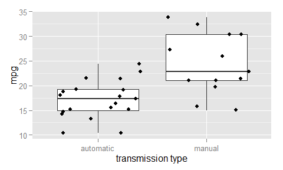
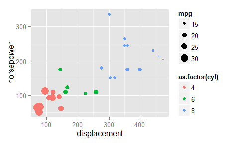
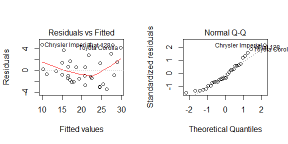

#### Predicting Miles Per Gallon using mtcars Data  


#### Excutive Summary  
Using data from 32 automobile vechicles model years 1973-1974, this study attempts to quantify the affect the transmission type (automatic or manual) has on consumption of fuel, measured in miles per gallon (mpg). While an independent samples t-test did find that the mpg gain for autos with manual transmission is between 3.2097 and 11.2802, transmission type alone is not the best predictor of mpg.  Using multivariate stepwise regression, it was found that the best predictor of miles per gallon is a combination of car weight, 1/4 mile time, and transmission type. In this model, a car with manual transmission  will experience a gain of 0.05 - 5.83 mpg over a car with automatic transmission.  

#### Data  
The data includes 11 measurements for each vehicle, which are: miles per gallon, number of cylinders, displacement (cu. in.), gross horsepower, rear axle ratio, weight (lb/1000), 1/4 mile time, engine shape (V or inline straight), transmission type, number of forward gears, and number of carburetors.

#### Exploratory Data Analysis
This table summarizes mpg by transmission type. See **Appendix A** for a boxplot of mpg by transmission type.  


```
##   transmission count  mean   sd
## 1    automatic    19 17.15 3.83
## 2       manual    13 24.39 6.17
```

#### Inference via Independent Samples T-Test  

The average mpg for manual transmissions is 7.24 mpg greater than automatic transmissions. An indepedent samples t-test was run to see these means were statistically different. Prior to running the independent t-test, the assumption of homogeneity of variance was testing using Levene's Test (see **Appendix B**). The p-value for Levene's Test was significant as 0.0496 and therefore the independent t-test proceeded assuming unequal variances.  

These data provide convincing evidence that automobiles with manual transmission will have better gas mileage than autos with automatic transmission, t(18.3323) = -3.7671, p-value = 0.0014.   These data suggest with 95% confidence that the mpg gain for autos with manual transmission will be between  3.2097 and 11.2802. However, the question must be asked, is mpg affected solely by transmission type, or do other factors help determine overall mpg of a car?

#### Regression Modeling  

**Bivariate Linear Regression**  
A bivariate linear regression was run with transmission type as the predictor. The full results of this model can be found in **Appendix C**. The adjusted r-squared is 0.3385, meaning that the transmission type accounts for 33.85% of the variability in miles per gallon. 

Bivariate analysis predicting mpg from each of the other nine car characteristics are all siginificant at 95% confidence, just as transmission type was. This table shows the p-value and adjusted r-squared for each bivariate linear model of the form *lm(mpg ~ predictor)*, in descending r-squared order.    


```
##       predictor     p.val adj.r.sq
## 1            wt 1.294e-10    0.745
## 2           cyl 6.113e-10    0.717
## 3          disp  9.38e-10    0.709
## 4            hp 1.788e-07    0.589
## 5          drat 1.776e-05    0.446
## 6            vs 3.416e-05    0.422
## 7  transmission  2.85e-04    0.338
## 8          carb 1.084e-03     0.28
## 9          gear 5.401e-03    0.205
## 10         qsec 1.708e-02    0.148
```
Making a prediction mpg from any one of these predictors would be misguided. A better solution is to find a parsimonious multivariate model using regressors (predictors) that are statistically significant in predicting miles per gallon. 

**Multivariate Linear Regression**  
Predicting mpg as a function of all 10 predictors results in a model without any statistically significant predictors at the 95% confidence interval. (see **Appendix D-1**). The problem is, many of the variables are confounding. For example, an engine with more cylinders is going to have a greater displacement and greater horsepower (see **Appendix D-2**). 

The next approach was to build a model using backwards stepwise regression, where all 10 predictors are introduced to the model, and working backwards, predictors are removed until the model reaches it's maximum predictive power. The results for the stepwise model are in **Appendix D-3**. The result is the parsimonious model in which **mpg is predicted by car weight, 1/4 mile time, and transmission type** with a strong adjusted r-squared of 0.8336. The residual plot (see **Appendix D-4**) shows random scatter of the fitted values against the residual, which is a sign of good fit.  

#### Summary of Findings  


From the parsimonious model, leaving car weigth and 1/4 mile time constant, a car with manual transmission will, on average, experience a gain in mpg of 2.94 over a car with automatic transmission, and a range of 0.05 - 5.83 mpg with 95% confidence.  

#### Appendix A: Exploration  

 

#### Appendix B: Independent Samples T-Test 
The results of the independent samples t-test.  

```
## Levene's Test for Homogeneity of Variance (center = median)
##       Df F value Pr(>F)  
## group  1    4.19   0.05 *
##       30                 
## ---
## Signif. codes:  0 '***' 0.001 '**' 0.01 '*' 0.05 '.' 0.1 ' ' 1
```

```
## 
## 	Welch Two Sample t-test
## 
## data:  mpg by transmission
## t = -3.767, df = 18.33, p-value = 0.001374
## alternative hypothesis: true difference in means is not equal to 0
## 95 percent confidence interval:
##  -11.28  -3.21
## sample estimates:
## mean in group automatic    mean in group manual 
##                   17.15                   24.39
```

#### Appendix C: Bivariate Regression Model  
**Miles Per Gallon as a Function of Transmission Type**    

```
## 
## Call:
## lm(formula = mpg ~ transmission, data = df)
## 
## Residuals:
##    Min     1Q Median     3Q    Max 
## -9.392 -3.092 -0.297  3.244  9.508 
## 
## Coefficients:
##                    Estimate Std. Error t value Pr(>|t|)    
## (Intercept)           17.15       1.12   15.25  1.1e-15 ***
## transmissionmanual     7.24       1.76    4.11  0.00029 ***
## ---
## Signif. codes:  0 '***' 0.001 '**' 0.01 '*' 0.05 '.' 0.1 ' ' 1
## 
## Residual standard error: 4.9 on 30 degrees of freedom
## Multiple R-squared:  0.36,	Adjusted R-squared:  0.338 
## F-statistic: 16.9 on 1 and 30 DF,  p-value: 0.000285
```

#### Appendix D-1: Model using all predictors
Coefficients and p-values for a model using all predictors.

```
##                    Estimate Std. Error t value Pr(>|t|)
## (Intercept)        12.30337   18.71788  0.6573  0.51812
## cyl                -0.11144    1.04502 -0.1066  0.91609
## disp                0.01334    0.01786  0.7468  0.46349
## hp                 -0.02148    0.02177 -0.9868  0.33496
## drat                0.78711    1.63537  0.4813  0.63528
## wt                 -3.71530    1.89441 -1.9612  0.06325
## qsec                0.82104    0.73084  1.1234  0.27394
## vs                  0.31776    2.10451  0.1510  0.88142
## transmissionmanual  2.52023    2.05665  1.2254  0.23399
## gear                0.65541    1.49326  0.4389  0.66521
## carb               -0.19942    0.82875 -0.2406  0.81218
```
#### Appendix D-2: Confounding Variables
Displacement, horsepower, and number of cylinders are all confounding variables related to each other. Including all of these in a model is redundant.  

 

#### Appendix D-3: Stepwise Model

```r
step.back <- step(lm(mpg ~ ., data = df), trace = 0, steps = 10000, direction = "backward")
summary(step.back)
```

```
## 
## Call:
## lm(formula = mpg ~ wt + qsec + transmission, data = df)
## 
## Residuals:
##    Min     1Q Median     3Q    Max 
## -3.481 -1.556 -0.726  1.411  4.661 
## 
## Coefficients:
##                    Estimate Std. Error t value Pr(>|t|)    
## (Intercept)           9.618      6.960    1.38  0.17792    
## wt                   -3.917      0.711   -5.51    7e-06 ***
## qsec                  1.226      0.289    4.25  0.00022 ***
## transmissionmanual    2.936      1.411    2.08  0.04672 *  
## ---
## Signif. codes:  0 '***' 0.001 '**' 0.01 '*' 0.05 '.' 0.1 ' ' 1
## 
## Residual standard error: 2.46 on 28 degrees of freedom
## Multiple R-squared:  0.85,	Adjusted R-squared:  0.834 
## F-statistic: 52.7 on 3 and 28 DF,  p-value: 1.21e-11
```

```
##                       2.5 % 97.5 %
## (Intercept)        -4.63830 23.874
## wt                 -5.37333 -2.460
## qsec                0.63457  1.817
## transmissionmanual  0.04573  5.826
```

#### Appendix D-4: Parsimonious Model Residual Plots
 

